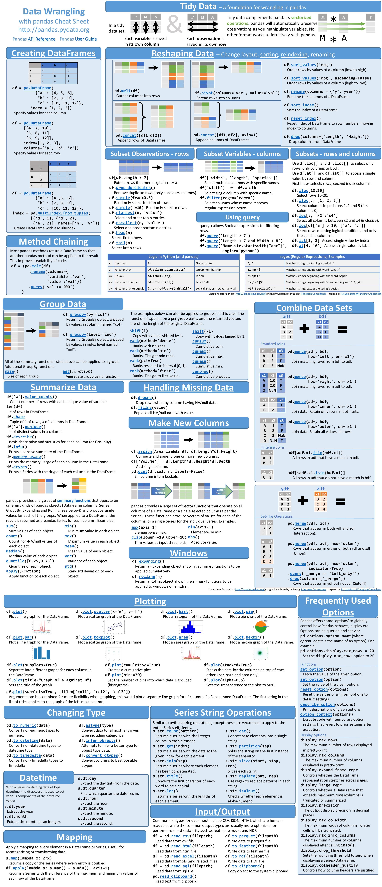

# 📊 00 - Análise de Dados com Pandas e Matplotlib

## Por que estudar Pandas e Matplotlib?

Antes de aplicar algoritmos de Machine Learning, é essencial dominar a **análise exploratória de dados (EDA)**. As bibliotecas **Pandas** e **Matplotlib** são as ferramentas usadas em conjunto para:

- **Limpar, transformar e visualizar dados**A
- **Criar gráficos que auxiliam decisões baseadas em dados**
- **Vizualizar o desempenho do seu modelo**

Com essas habilidades, você será capaz de entender melhor seus dados e tomar decisões mais informadas durante a modelagem.

---

## O que você encontrará nesta pasta?

### 📚 Cursos e Exercícios

- `Pierian_Pandas_Analysis/`, `Pierian_Pandas_Exercises/`, `Pierian_Matplotlib/`:  
  São materiais adaptados dos cursos da **Pierian Data**, uma das plataformas mais renomadas para quem está começando com Python para Data Science.

- `100-pandas-puzzles/`:  
  Uma coletânea de 100 exercícios para praticar seus conhecimentos em Pandas. Projeto de [Ajay Ohri (ajcr)](https://github.com/ajcr/100-pandas-puzzles) com foco em resolver pequenos desafios práticos.

- **Livro "Python for Data Analysis" — Wes McKinney (O’Reilly)**:  
  Uma abordagem completa para aprender análise de dados com Pandas e Matplotlib, ideal para quem prefere aprender por curso aprofundado em formato de livro.  
  Acesse gratuitamente via [Internet Archive](https://archive.org/details/python-for-data-analysis_202402/page/14/mode/2up).

Essas folhas de referência estão disponíveis em melor resolução em:

- [`cheatsheets/Pandas_Cheat_Sheet.pdf`](cheatsheets/Pandas_Cheat_Sheet.pdf)
- [`cheatsheets/Matplotlib_Cheat_Sheet.pdf`](cheatsheets/Matplotlib_Cheat_Sheet.pdf)

## 📎 Recursos adicionais

Se quiser revisar ou testar seus conhecimentos no final, recomendamos:

- [Tutorial de Pandas — W3Schools](https://www.w3schools.com/python/pandas/default.asp)  
- [Tutorial de Matplotlib (rótulos) — W3Schools](https://www.w3schools.com/python/matplotlib_labels.asp)

---

## 🧠 Em caso de dúvidas

Você também pode consultar:

- A [documentação oficial do Pandas](https://pandas.pydata.org/docs/)
- A [documentação oficial do Matplotlib](https://matplotlib.org/stable/contents.html)

## 📌Consultas rápidas e apoio visual

Durante seus estudos, você pode consultar os materiais de referência rápida abaixo. Eles são extremamente úteis para lembrar os principais comandos:

### Pandas Cheatsheet

### Matplotlib Cheatsheet

